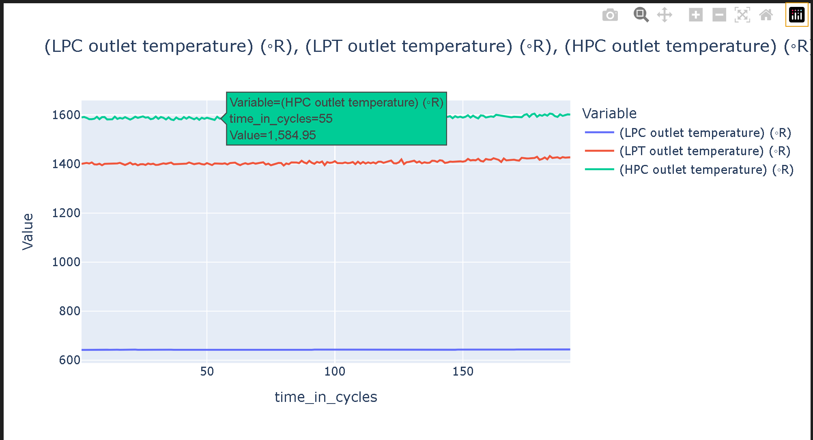

# Plotly Boilerplate — Test Data Plots

Reusable Plotly templates for engineering test data:
1) **Multi-Y vs single X**: plot multiple dataframe columns against one x-axis.  
2) **3D scatter**: quick exploratory 3D view with color/size encodings.

---

## ✨ Features
- One-liner to plot `y=[col1, col2, ...]` vs `x=timestamp` (or any column)
- Auto-labeling, legend, grid, hover tooltips
- Export to **HTML** (shareable, interactive)
- 3D scatter with optional **color**/**size** mappings

---




Click to play 👇


## Quick Start

## 🚀 How to Run
Clone the repo and install dependencies:

```bash
git clone https://github.com/ratrent55/plotly_test_data.git
conda env create -f environment.yml
